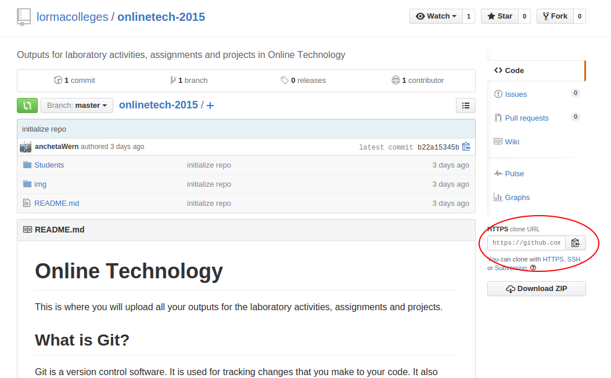
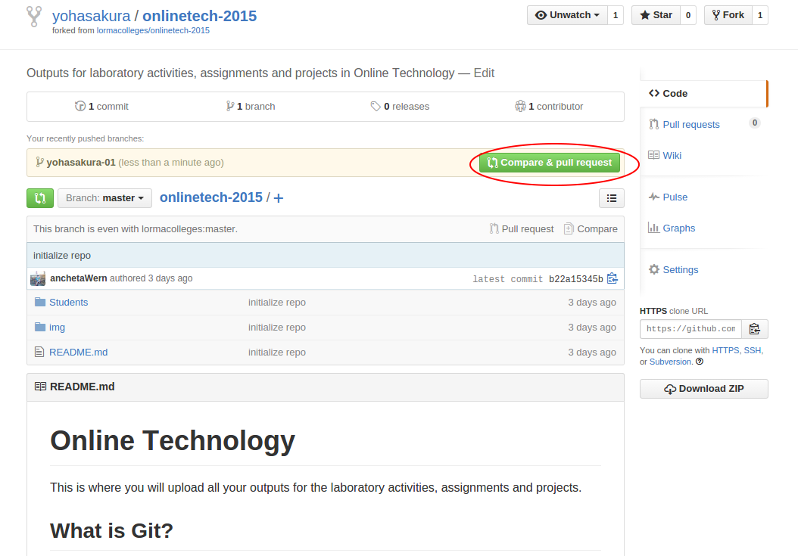
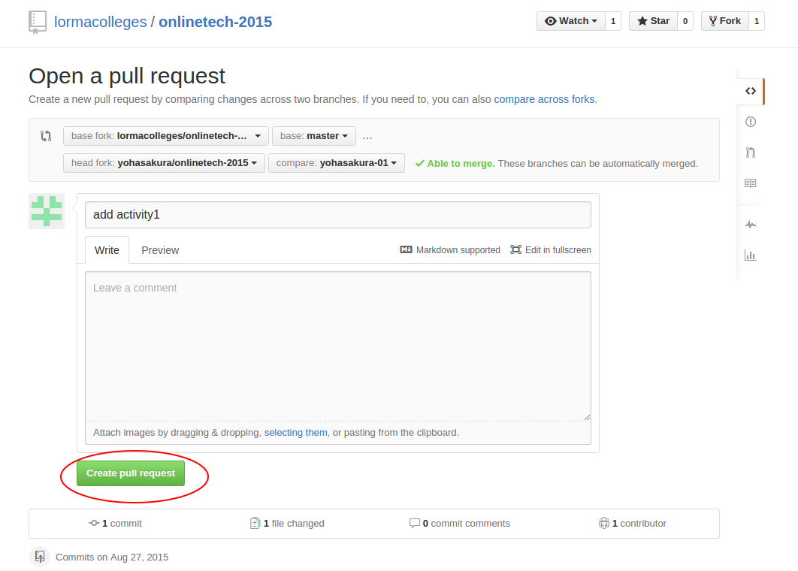
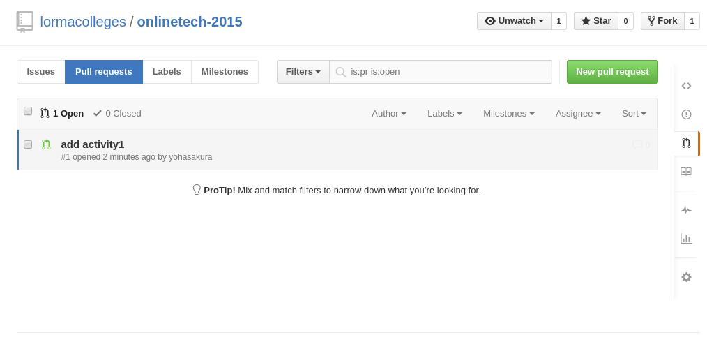
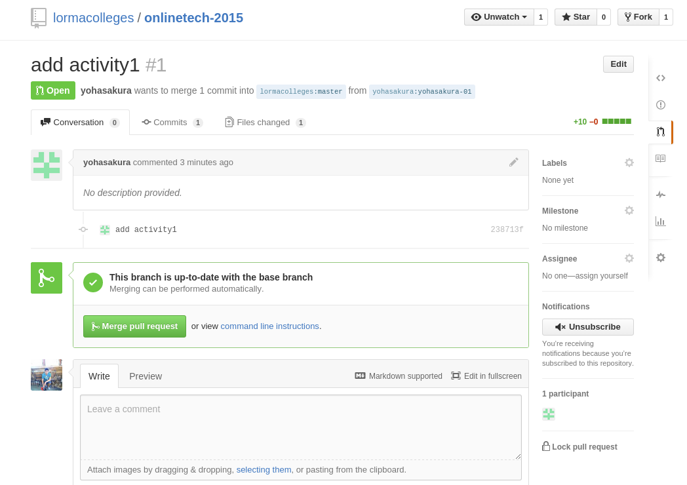
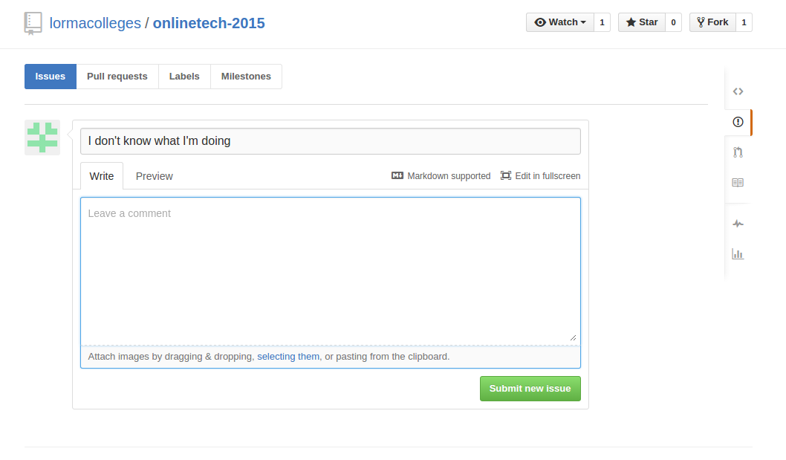

#Online Technology

This is where you will upload all your outputs for the laboratory activities, assignments and projects.

##What is Git?

Git is a version control software. It is used for tracking changes that you make to your code. It also allows multiple people to work on the same code base. With Git you can easily know which changes were made to your code, you can also revert it to a previous state as long as that state was committed.

##Working with Git

To prepare files to be added into your next commit (staging), you use the `git add` command. 

- `git add .` - adds all the files
- `git add *.html` - adds all html files
- `git add index.html css/style.css` - adds specific files

To commit your changes, you use the `git commit` command. What this does

- `git commit -m "description of what you did in this specific commit"` - directly passing the description by using the `-m` option followed by the description.
- `git commit` - opens up the default text-editor in the terminal and allows you to type a multi-line commit message. 

To upload your changes to Bitbucket use the `git push` command:

```
git push origin master
```

Where `origin` is the name that you gave to the remote repository and`master` is the name of the branch that you want to upload. 

In Git you can create branches. Branches allows you to organize your repository into groups. The default branch in Git is called `master`. To create a new branch:

```
git branch NAME-OF-BRANCH
```

To switch to the branch that you created:

```
git checkout NAME-OF-BRANCH
```

To create a new branch and then switch to it immediately:

```
git checkout -b NAME-OF-BRANCH
```

Note that when uploading this branch you have to use its name.

```
git push origin NAME-OF-BRANCH
```


##Working with the Repository

1. Create your own Github account using your Lorma email. If you don't have one, please go to the IT Services office. 
2. Once you're logged in to Github, click on the 'fork' button found at the upper right side of the screen. This copies the repo into your own account.
3. On your computer, use `git clone YOUR-CLONE-URL` to clone your own copy of the repo. On Github, you can find your clone URL by going to the page of your fork and look for 'clone URL'. Here's an example:

```
git clone https://github.com/isabelancheta/webapp2-2015.git
```

Here's a screenshot in case you can't find the clone URL:



###Setup User Details

To add user details to Git:

```
git config user.email "YOUR-LORMA-EMAIL@lorma.edu"
git config user.name "Your-Firstname Your-Lastname"
```

###New Branch for Every Activity

For every activity you need to create a new branch in the repository. For example: 

```
git checkout -b activity1
```

In the root of your local repository, open the `Students` folder. Inside the folder, create a new folder with the following format: `LASTNAME, Firstname, MI`. (e.g `TAMAD, Juan P.`). Open that folder and create another one and name it after the name that you gave to the branch (e.g `activity1`). This folder is where you put the files that you used in the activity.

###Submitting your Work

As everything in Github is public, you need to submit your work on or before the time specified by the instructor. This is to prevent your work from being copied. Any work that is submitted after the specified time is considered late and points will be deducted. Late work submitted 24 hours after the specified time of submission won't be accepted.

To submit your work, you have to push it first to your clone.

```
git push origin activity1
```

Note that `activity1` should be the same as the name of the branch that you created.

Once you have successfully pushed your changes, go to the page of your fork of the repo and click on the 'Compare & Pull Request' button.



This would redirect you to the page where you can edit the title and the description for the pull request. The title should always contain the name of the activity. You can leave the description blank. But if you want to explain something about your work, you can add it on the description. Once those are done, click on the 'create pull request' button. This allows the instructor to see that you have submitted your work.



Your work can now be seen in the original repo.



The instructor can then merge your work to the original repo. Once your work has been merged, it means that the instructor has already checked your work. If the instructor is not happy with your work yet, you can see a comment requesting for changes. You can then go back to your computer, make the necessary changes then use `git push` again to upload your work. At this point, since you have already submitted a pull request, the changes that you have made is automatically applied to your pull request. So you no longer need to create a new one.




###Issues

If you have any problems in any of the things mentioned above, you can create an issue. Just go to the [issues page](https://github.com/lormacolleges/onlinetech-2015) and click on the 'new issue' button. This will redirect you to the page where you can describe what your issue is all about. Click on the 'submit new issue' button to submit your issue.



Be sure to check the existing issues if it's the same as yours so you don't create a duplicate issue. Just comment on the issue and say that you have the same problem.


